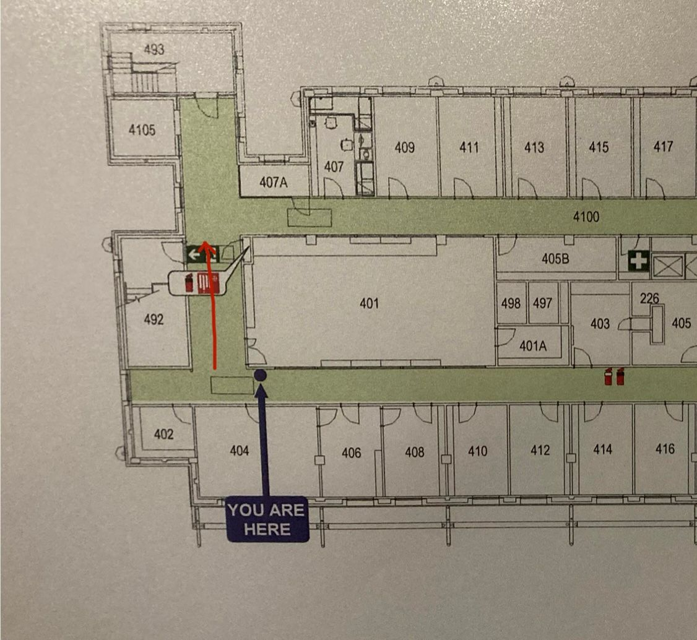

# 19_09_25_straight_down

Walk start: 19.92s. 
Walk end: 23.16s.
Description: Moved forward 5m for 3.24s. Walked the route given below:

Orientation: OF facing ELEC Lv4 floor (carpet).
Speed: 1.54m/s

Post-processing notes:
- OF raw data are all zeros