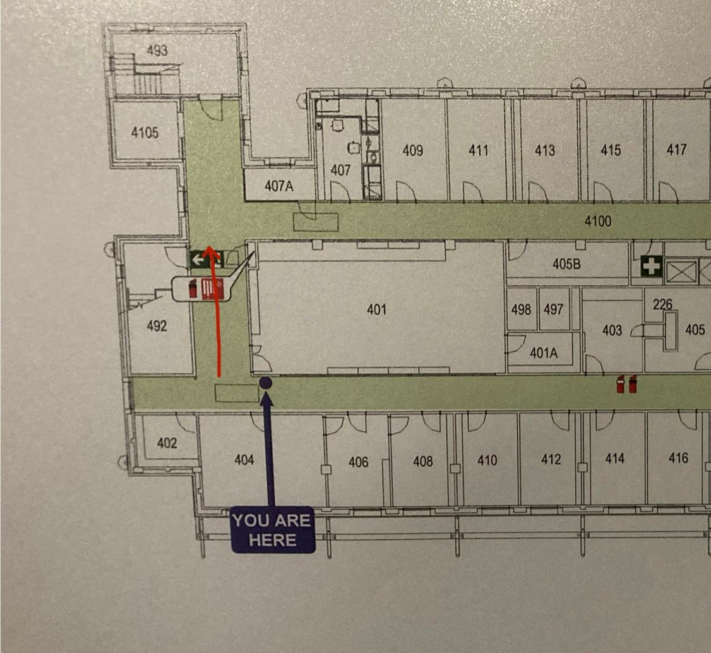

# 19_09_25_straight_down

Walk start: 16.98s. 
Walk end: 20.13s.
Description: Moved forward 5m for 3.15s. Walked the route given below:

Orientation: OF facing ELEC Lv4 floor (carpet).
Speed: 1.59m/s
OF sample rate: 10Hz.