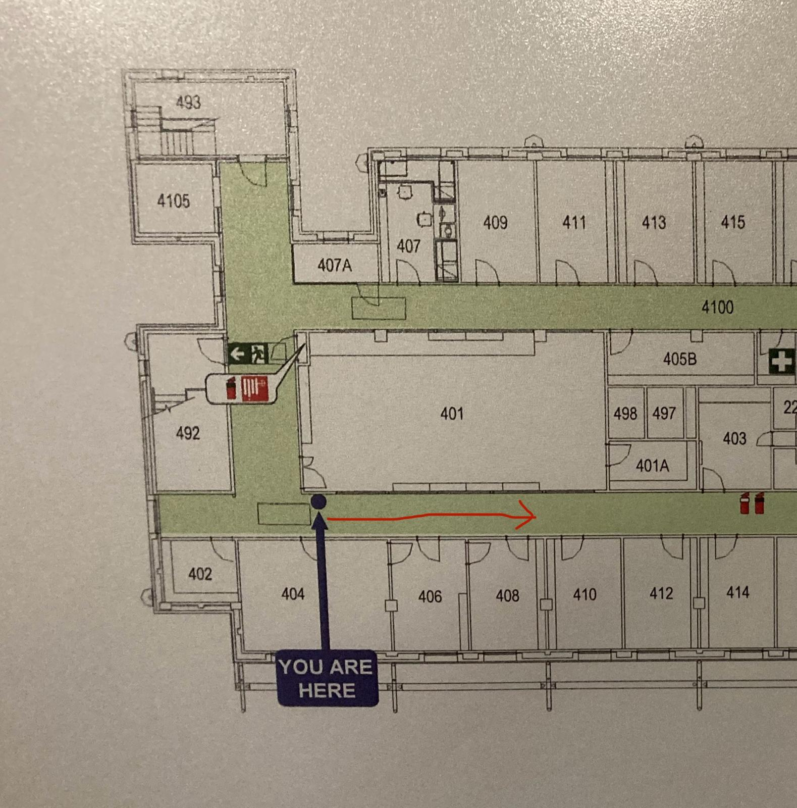

# 19_09_25_straight_up_Lv4

Walk start: 14.38s.
Walk end: 17.59s.
Description: Moved forward 5m for 3.21s. Walked the route given below:

Orientation: OF facing ELEC Lv4 roof.
Speed: 1.56m/s.
OF sample rate: 10Hz.