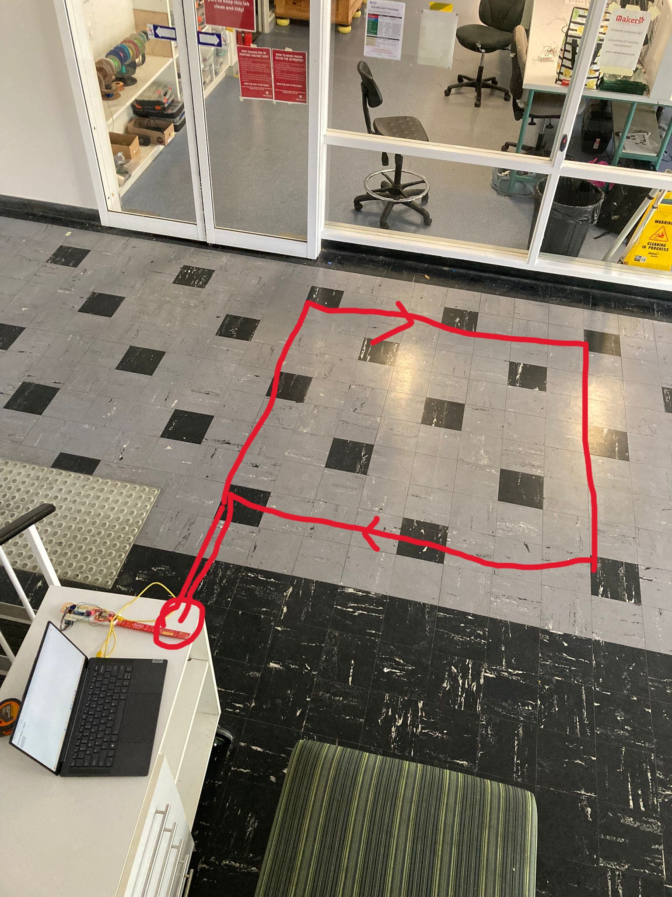
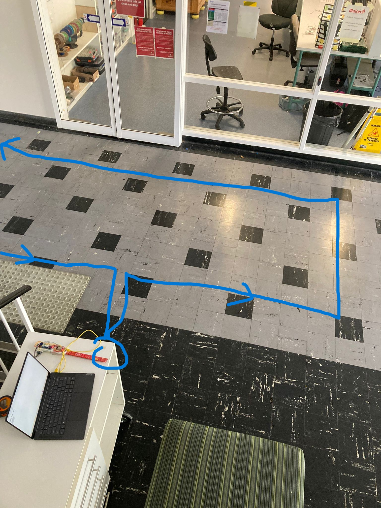

# Combined Samples
Samples without OF lens:
- square = 1.2m x 1.2m rectangle turning 90 degrees to the right at each vertex.
- line = walked the length of the tables at Ezone central, turned 180 degrees and returned to starting point before ending the recording.

Samples with OF lens:
- square2 = 1.6m x 1.6m rectangle turning 90 degrees to the right at each vertex. Started and finished at a table outside the square. Refer to the image below.

- rectangle = 9m x 1.6m rectangle turning 90 degrees to the right at each vertex. Started and finished at a table outside the square. Refer to the image below.

Note: The first and last 2 seconds of ToF and OF data should be ignored since the device was not parallel to the floor.

