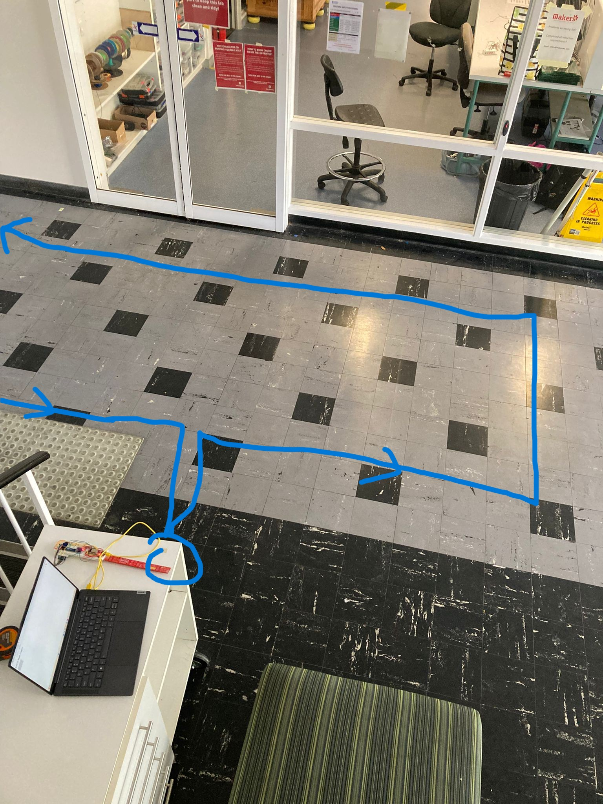

rectangle = 9m x 1.6m rectangle turning 90 degrees to the right at each vertex. Started and finished at a table outside the square. Refer to the image below.

Perimeter = 21.2 m

Approximate start and end: 24 - 61 secs

Note: The first and last 2 seconds of ToF and OF data should be ignored since the device was not parallel to the floor.